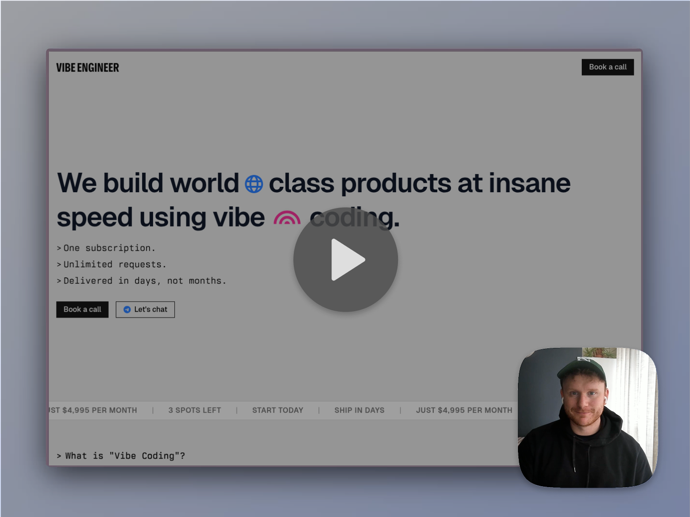

<p align="center">
  
</p>

# Website Screenshot Service

**Capture any webpage and style it like a Screen Studio / Loom frame – in one API call.**

Website Screenshot Service is a lightweight, developer‑friendly API for grabbing screenshots and adding overlays or other post‑processing. Perfect for QA snapshots, uptime monitoring, changelogs, social previews, or any creative automation. Deploy it locally or on Railway in minutes.

---

## 🚀 Features

* Blazing‑fast screenshot endpoint with built‑in job queue
* Canvas overlay pipeline for frames, watermarks, emojis – you name it
* Playwright + Browserless under the hood (stealth + CAPTCHA support)
* Works **locally, in Docker, or on cloud runners**
* Simple `.env` configuration & verbose logging
* MIT‑licensed, 100 % hack‑able

---

## 🏗️ Quick Deploy

```bash
# local dev
pnpm i
pnpm dev            # spins up API + local Browserless container

# one‑liner prod (Docker)
docker compose up -d
```

### Railway

1. **Create two services** from this repo – `api` (root dir `api`) and `browserless` (`browserless` folder).
2. Turn on **Private Networking**.
3. Set the API env var `BROWSERLESS_WS` to:

   ```
   ws://browserless:3000/?token=YOUR_TOKEN
   ```

   (Railway’s internal DNS lets the API reach the pool privately.)

---

## 🌱 Other branches

| Branch        | Why you’d use it                                              |
| ------------- | ------------------------------------------------------------- |
| `cloudflare`  | Fully serverless Worker + Durable Objects                     |
| `browserbase` | Outsource browsers to [Browserbase](https://browserbase.com/) |

---

## 🔑 Env vars (excerpt)

| Key                 | Example                                                   | Notes                      |
| ------------------- | --------------------------------------------------------- | -------------------------- |
| `PORT`              | `3000`                                                    | API listen port            |
| `BROWSERLESS_WS`    | `ws://browserless:3000/?token=...`                        | WebSocket to Chromium pool |
| `BASE_IMAGE_URL`    | `https://files.duckhou.se/website-screenshot/base.png`    | background frame           |
| `OVERLAY_IMAGE_URL` | `https://files.duckhou.se/website-screenshot/overlay.png` | foreground overlay         |

See `.env.example` for the full list.

---

## 📦 API

### `GET /screenshot?url=https://example.com`

Returns a **PNG** of the rendered site with overlays.

```bash
curl "https://api.yourdomain.com/screenshot?url=https://example.com" \
  --output screenshot.png
```

---

## 🙌 Made by Vibe Engineer

Website Screenshot Service is crafted and maintained by **[Vibe Engineer](https://vibe.engineer)** – a fractional‑CTO as a subscription that ships. Need an extra pair of hands? [Book a call](https://vibe.engineer)

---

## License

MIT — © Vibe Engineer
